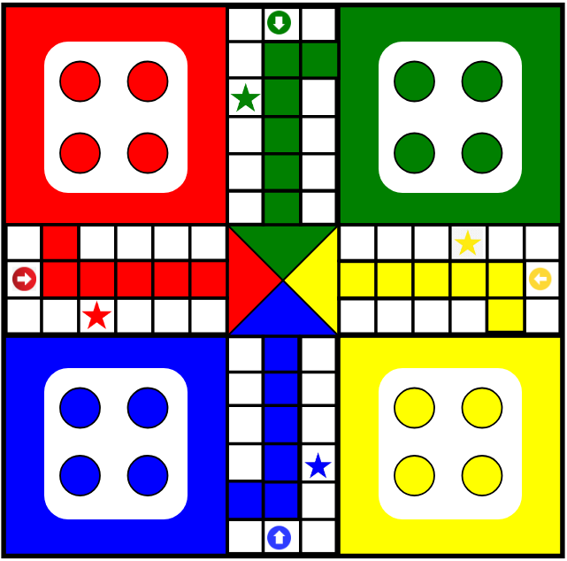

# 🎲 Ludo Clone - SVG Design

This is a basic **Ludo Board Clone** created using pure SVG. It represents the static layout of a classic Ludo game with four colored home bases and a central zone.

---

## 📸 Screenshot



---

## ✨ Features

- 🎨 Clean SVG-based Ludo board design
- 🟩 4 Colored Zones: Green, Yellow, Blue, and Red
- ➕ Central white cross path with colored entry blocks
- 🔲 Pawn zones (can be used to place tokens)
- 🔺 Decorative triangle at the center
- 💡 Simple to customize and expand using HTML, CSS, or JS

---

## 📐 Layout Overview

- **Home Bases**: Four corners for each player
- **Center Pathways**: White and colored paths leading to the center
- **Center**: Triangle with color options

---

## 🧱 Technologies Used

- `HTML`
- `SVG` (Scalable Vector Graphics)

---

## 🔧 How to Use

1. Copy the SVG code into your HTML file.
2. Customize token circles and add interactions using JavaScript.
3. You can enhance it further using CSS animations or JavaScript-based game logic.

---

## 📄 Sample Embed

````html
<svg width="400" height="400" viewBox="0 0 400 400" xmlns="http://www.w3.org/2000/svg">
  <!-- Your SVG Design Goes Here -->
</svg>
````

---

## 🚀 Future Improvements

- Add player tokens using `<circle>`
- Add dice functionality with JavaScript
- Make it interactive and playable

---

> 🛠️ This is a static design. You can build the entire Ludo game logic on top of this using HTML, CSS, and JavaScript.
